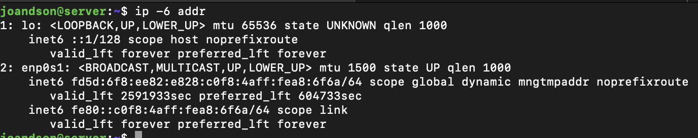
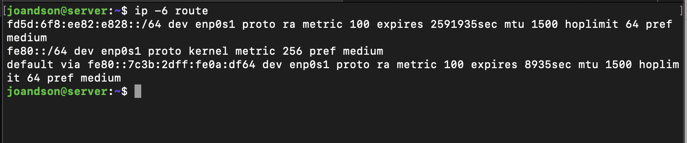
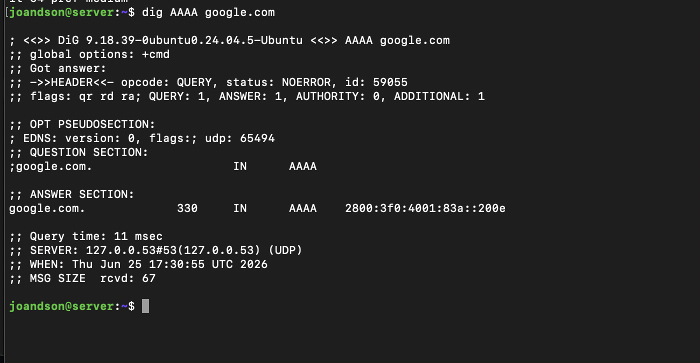

# Lab IPv6 — Diagnóstico de Endereçamento e DNS IPv6

## Status da etapa

Etapa 5 de 7 — Lab IPv6 com evidências.

## Objetivo

Este laboratório tem como objetivo validar configurações básicas de IPv6 em uma VM Linux acessada via SSH.

O foco é simular uma análise inicial feita por um técnico de Data Center ao verificar se um servidor possui endereçamento IPv6, rota IPv6 e resolução DNS para registros `AAAA`.

## Cenário simulado

Neste laboratório:

- O macOS representa a estação técnica de acesso.
- A VM Linux via UTM representa um servidor em ambiente simulado de Data Center.
- O acesso ao servidor é realizado via SSH.

## Conceito principal

IPv6 é usado em ambientes modernos de rede, cloud e Data Center.

Mesmo que uma aplicação funcione corretamente em IPv4, ela pode apresentar falhas em IPv6 por problemas como:

- ausência de endereço IPv6;
- rota IPv6 inexistente;
- firewall bloqueando tráfego IPv6;
- registro DNS `AAAA` incorreto;
- serviço não escutando em IPv6;
- diferença de configuração entre IPv4 e IPv6.

## Ambiente utilizado

```text
Estação técnica: macOS
Servidor simulado: VM Linux Ubuntu via UTM
Acesso: SSH
Rede utilizada: rede local / NAT da VM
Data do teste: 24/06/2026
```

---

# Teste 1 — Verificar endereços IPv6 da VM Linux

## Comando utilizado

```bash
ip -6 addr
```

## Objetivo

Confirmar se a VM Linux possui endereços IPv6 configurados nas interfaces de rede.

## Resultado observado

```text
Preencher com o resultado resumido.
```

## Interpretação técnica

```text
Preencher com a interpretação após executar o comando.
```

Exemplo:

```text
A VM Linux possui endereço IPv6 configurado na interface de rede. Isso indica que o sistema operacional reconhece IPv6 no ambiente analisado.
```

---

# Teste 2 — Verificar rotas IPv6 da VM Linux

## Comando utilizado

```bash
ip -6 route
```

## Objetivo

Verificar se a VM Linux possui rotas IPv6 configuradas.

A presença de endereço IPv6 não garante, sozinha, conectividade externa por IPv6. Para isso, também é necessário existir rota adequada.

## Resultado observado

```text
Preencher com o resultado resumido.
```

## Interpretação técnica

```text
Preencher com a interpretação após executar o comando.
```

Exemplo:

```text
A VM Linux possui rota IPv6 configurada. Isso indica que existe caminho definido para tráfego IPv6.
```

Se aparecer apenas rota local ou link-local, use esta interpretação:

```text
A VM Linux possui configuração IPv6 local/link-local, mas não foi identificada uma rota IPv6 global para acesso externo. Nesse cenário, o IPv6 pode estar disponível localmente, mas sem conectividade externa.
```

---

# Teste 3 — Consultar registro DNS AAAA

## Comando utilizado

```bash
dig AAAA google.com
```

## Objetivo

Verificar se o DNS consegue retornar registros IPv6 para um domínio.

Registros `AAAA` são usados para associar nomes de domínio a endereços IPv6.

## Resultado observado

```text
Preencher com o resultado resumido.
```

## Interpretação técnica

```text
Preencher com a interpretação após executar o comando.
```

Exemplo:

```text
O DNS retornou registros AAAA para google.com, indicando que o domínio possui endereços IPv6 associados.
```

---

# Evidências

### 1. Endereços IPv6 da VM Linux



### 2. Rotas IPv6 da VM Linux



### 3. Consulta de registro DNS AAAA



---

# Checklist de diagnóstico IPv6

```text
[ ] A VM possui endereço IPv6?
[ ] A VM possui endereço link-local?
[ ] A VM possui endereço IPv6 global?
[ ] Existe rota IPv6 configurada?
[ ] Existe rota IPv6 para acesso externo?
[ ] O DNS retorna registro AAAA?
[ ] O problema ocorre apenas em IPv6?
[ ] O IPv4 funciona normalmente?
```

---

# Registro de evidência do laboratório

```text
Data: 24/06/2026
Estação técnica: macOS
Servidor simulado: VM Linux Ubuntu via UTM
Tipo de acesso: SSH
Rede utilizada: rede local / NAT da VM

Teste 1 — Endereços IPv6:
Resultado:
Interpretação:

Teste 2 — Rotas IPv6:
Resultado:
Interpretação:

Teste 3 — Registro DNS AAAA:
Resultado:
Interpretação:

Conclusão geral:
```

---

# Conclusão do Lab IPv6

Este laboratório valida a presença de endereçamento IPv6, rotas IPv6 e resolução DNS para registros `AAAA`.

Em uma rotina de Data Center, esse tipo de validação ajuda o técnico a diferenciar falhas de IPv4, IPv6, DNS, rota, firewall ou configuração do serviço.

Mesmo quando IPv4 funciona corretamente, IPv6 precisa ser analisado separadamente para evitar diagnósticos incompletos.
